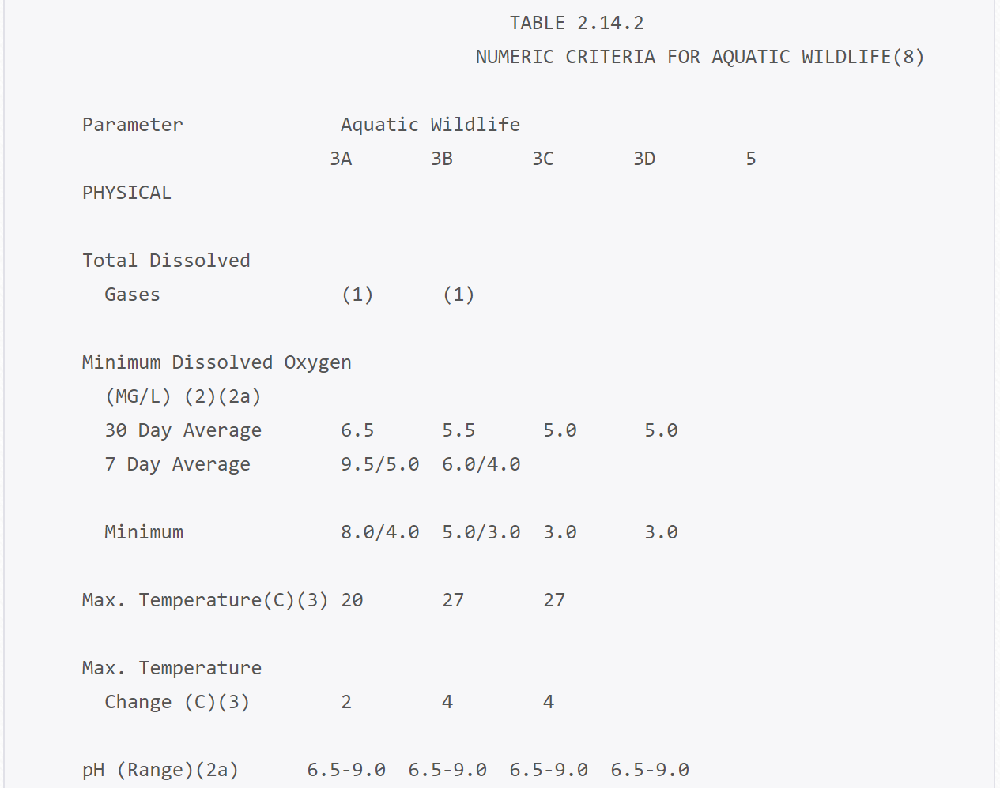
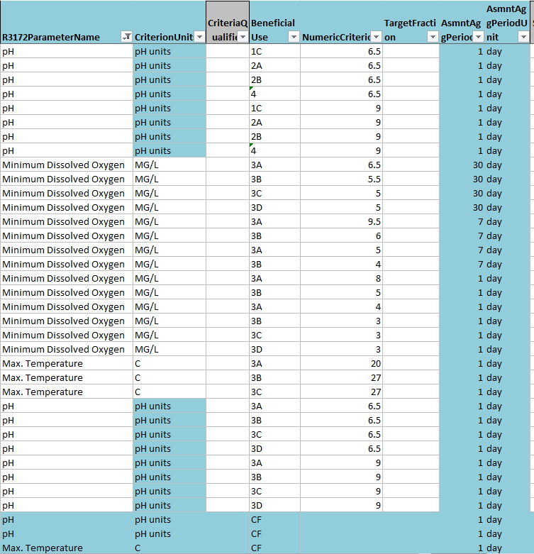

----

## Introduction

Big data drives organizations and creates trust in their decision-making processes. While it’s easier than ever to generate large quantities of data quickly, the resulting datasets can be complicated, unwieldy, and quickly overwhelming. 

The Harvard Business Review (2017) reported that:

* “Less than half of an organization’s structured data is actively used in decision making.
* Eighty percent of an analyst’s time is spent discovering and preparing data.
* An [organization’s] technology often isn’t up to the demands put on it.”

The Integrated Report (IR) team uses all readily available and credible water quality data from throughout the state to compile the Integrated Report. Working with big datasets from different sources poses considerable challenges. The IR Programming Team re-evaluated how the Division of Water Quality (DWQ) uses technology to organize, analyze, and visualize big data. With the support of the Department of Environmental Quality’s (DEQ) continuous improvement initiative, the team developed agile, effective, and efficient processes for sorting and analyzing the data DWQ uses to make decisions on the quality of the surface waters of the state. 

----

## Challenges

### Large scope of data

#### *Challenge*
DWQ collects and analyzes a vast amount of data from rivers, streams, and lakes across the state for its water quality assessments. The IR team received and screened 1.36 million data records for the Draft Combined 2018/2020 IR and produced 61,388 unique assessments by site, use, and criterion. Data review totals for key areas of this report include:

* Assessment Units (AUs): 913 
  + Utah’s rivers and streams are divided into segments (AUs) for data review and reporting. Lakes are considered individual assessment units. 
* Designated beneficial use assignments: 622
  + Use assignments protect state waters for their designated beneficial uses, which include      drinking water, recreation, aquatic life, agriculture and the Great Salt Lake.
* Unique assessment criteria: >1,000
  + Criteria can be site-specific, temporally specific, or calculated based on pH, hardness, and/or temperature 

#### *Solution*
The IR Team used the open-source programming language R to automate processing and analysis of the large amount of data received for the report. R programming functions built for the IR include:

* Site validation
* Detection limit ranking and assignment
* Meta-data screening
* Data preparation for assessment
* Numeric criteria assignment
* Exceedance counting
* Water quality assessment category assignment at multiple spatial scales (site and assessment unit). 

After running data through the automated processes, DWQ scientists conducted a secondary review of the screened dataset  to ensure accuracy and completeness.

The initial round of automated screening produced 432,280 thoroughly vetted records.The staff’s secondary review of these screened data eliminated an additional 35,281 unsuitable records, leaving a core assessment dataset of 348,003 records. Automated screening plus scientific review streamlined the assessment process, made data review more manageable, and improved consistency and transparency. <br>
<br>

### Harmonizing datasets

#### *Challenge*
The IR relies on multiple data sources from inside and outside the agency. Differences in methods, assessed parameters, site types, and platforms can complicate data interpretation and analysis for assessments. DWQ must harmonize data with different file formats, naming conventions, methods, units, parameters, and values into a consistent, sortable dataset. In previous IRs, the process was inefficient and time-consuming.

#### *Solution* 
DWQ required all data submissions for this reporting cycle to be routed through the Environmental Protection Agency’s (EPA’s) Water Quality Portal (WQP) using WQX Web. All submitters were required to register for the Call for Data to receive instructions on preparing and submitting data through the online submission form. DWQ provided WQX- and DWQ-compatible Excel spreadsheet templates for data uploads along with training sessions/videos to walk people through the process. Uniform templates, consistent data submission requirements, and uploads to a central database dramatically reduced staff time spent harmonizing multiple data sets. DWQ scientists  also created a series of translation tables that ensured all accepted data had proper detection limits, came from accredited laboratories, and had consistent parameter names, fractions, and units despite their origination from different sources. 
<br>
<br>

### Batch data processing

#### *Challenge* 
Previous IRs analyzed data parameter-by-parameter or criterion-by-criterion. Beneficial use criteria for each use, for example, were input into parameter-specific databases. Interfacing data and assessments between parameter-specific datasets and merging these multiple databases made the assessment process slow and labor-intensive.   

#### *Solution*
Batch data processing sorts large amounts of data into a group or batch. The IR team developed tools to centralize beneficial use criteria (such as site-specific criteria, seasonal criteria, and formula-derived criteria) and connect them to all available data in one step to facilitate batch processing.The team developed batch assessment tools that aggregated dissimilar data (site, use, parameter, number of exceedance, and number of exceedances of criteria) for all sites, uses, and parameters. DWQ scientists could use a single process to review these data and determine the preliminary category (fully supporting or not supporting uses) for individual sites. Batch processing streamlined the assessment process, saved staff time, and reduced the possibility of errors when merging multiple datasets.
<br>
<br>

### Digitizing criteria & uses

#### *Challenge* 
Information used in the IR has to be digitized: converted into a format that can be sorted and processed by computer. Beneficial uses, criteria, assessment units, and other data requiring digitization for the IR assessment process hadn’t been digitized in consistent, linkable formats. This made data digitization and processing difficult and confusing. 

#### Water quality criteria
Water quality criteria are stored in mixed format text tables online. These criteria must be digitized and reformatted to a criterion database, including essential temporal and spatial metadata, to link criteria and data automatically.
<h5>[Utah water quality standards](https://rules.utah.gov/publicat/code/r317/r317-002.htm){target="_blank"}</h5>  
<br>
<br>

```{r, echo=F, out.width="100%", fig.cap="Native web format of [Utah water quality criteria](https://rules.utah.gov/publicat/code/r317/r317-002.htm){target='_blank'}."}

```
<br>

```{r, echo=F, out.width="100%", fig.cap="Flattened database format of Utah water quality criteria."}

```
<br>


#### Temporal & spatial components
Text-format geographical beneficial use descriptions and site specific criteria needed to be digitized into geographical polygons to allow automatic assignment of uses and criteria 
to water quality monitoring locations.

```{r, echo=F, out.width="100%", fig.cap="Beneficial uses and site specific criteria polygons for Utah."}
library(leaflet)
wqTools::buildMap() %>% showGroup('Beneficial uses') %>% showGroup('Site-specific standards')
```
<br>

#### Formula derived criteria
Several criteria are sample specific, depending on other factors at the time of sampling like hardness, pH, or temperature. These mathematical formulas needed to be stored along with the criteria and automatically calculated for each 
applicable sample. 
```{r, echo=F, out.width="100%", fig.cap="Hardness corrected criteria.", out.extra='style="border: none;"'}
knitr::include_url("https://bookdown.org/jakevl/hardness-dep-crit/hardness_dep_crit.html", height="500px")
```


#### *Solution* 
The IR team put the criteria and spatial data into a central location and uniform format so staff could automatically assign criterion formulas and appropriate correction factors to data records. Increased automation and improved “communication” between digitized datasets made the assessment process more efficient and effective.
<br>
<br>

----


