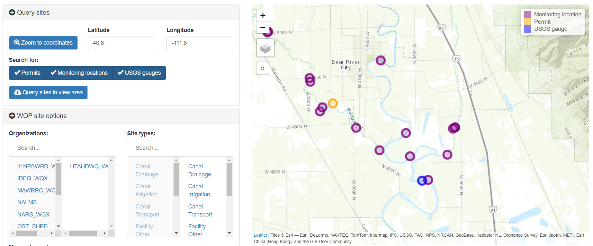
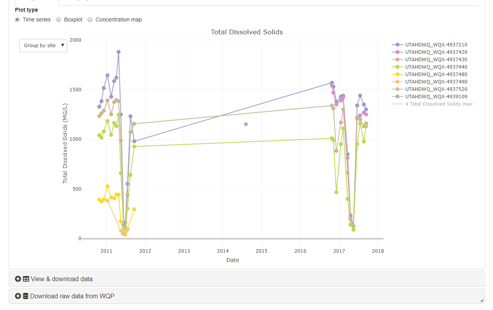

<style type="text/css">
.leaflet .legend i{
	border-radius: 50%;
	width: 10px;
	height: 10px;
	margin-top: 4px;
}
</style>


----

In the process of programming water quality assessment tools, the team also developed a wide ranging set of tools to access, assess, analyze, and communicate water quality data.

----

## Accessing data
The first and often most time consuming challenge of any water quality data analysis is finding and aggregating appropriate data. This may include ambient water quality monitoring, 
permitted discharge, and stream flow data. The IR programming team has developed tools to find and read relevant water quality data from AWQMS, the EPA Water Quality Portal, EPA ECHO, 
and USGS NWIS databases. Each of these databases are web-services enabled. The tools developed by the IR programming team are designed to read data based on user specified query attributes, 
such as assessment unit, HUC boundary, site or permit identifiers, and parameters directly to an R workspace so that it can be rapidly updated and requeried in a repeatable manner directly 
within an analytical workflow. One of the unique attributes of this toolset is the ability to view and select sites for data queries from multiple water quality databases in an integrated manner.  

<br>

```{r, out.width="100%", fig.cap="Finding ambient water quality monitoring locations, permitted discharges, and USGS stream gauges along the Bear River.", echo=F}

#knitr::include_graphics()
```

----

## Water quality assessment
Water quality assessment was the driving motivation for the development of this suite of tools. UDWQ is now using these tools for the purposes of completing water quality assessments and 
generating [305(b) and 303(d) lists for the Integrated Report on water quality conditions in the state of Utah](https://deq.utah.gov/legacy/programs/water-quality/monitoring-reporting/assessment/index.htm){target="_blank"}. 
This suite of tools includes functions for screening water quality data 
to ensure they meet minimum quality criteria and are applicable to water quality standards, assigning beneficial uses and water quality criteria, calculating formula derived criteria, identifying and counting 
exceedances of water quality criteria, and assigning sites and assessment units to assessment categories as described in Utah Integrated Report methods. This toolset also includes interactive applications designed 
to allow internal reviewers of the IR to analyze and visualize water quality data and assessments and provide interpretation and feedback to the IR team.

<br>

```{r, out.width="100%", fig.cap="Reviewing stream total dissolved solids (top) and lake profile (bottom) assessments for the IR.", echo=F}

knitr::include_graphics("images/lake-profs.png")
```
<br>

----

## Integrated data analysis

One of the most exciting outcomes of this process has been the development of tools to interactively analyze both spatial and temporal patterns in water quality, using multiple types of data from multiple sources. 
This suite of tools allows a user to rapidly query applicable water quality data by assessment unit, HUC, or site identifier, then generate figures to characterize trends in space and time.
<br>

```{r, out.width="60%", fig.cap="Spatial patterns in total dissolved solids in Utah Lake. Data extracted and analyzed using tools developed by the IR programming team. Note the substantially lower TDS concentrations in Provo Bay (east bay of lake)", echo=F}
knitr::include_graphics("images/wqdd4.png")
```
```{r, out.width="100%", fig.cap="Utah DWQ's COVID-19 wastewater monitoring dashboard.", echo=F}
knitr::include_graphics("images/wqdd3.png") # update
#knitr::include_app("images/wqdd3.png")
```
<br>

----

## Communication
Extracting and analyzing water quality data is important, but effective communication of results to the public, stakeholders, and scientists is essential for making good water quality management decisions. As such, the IR programming team has 
also been developing interacitve applications, documents, presentations, and pages (this one included) that let users interactive with and understand the data, analyses, and conclusions that DWQ scientists and engineers base water quality 
management decisions on. This increases the transparency and accountability of DWQ scientists and engineers and can help generate understanding and buy in from the public and stakeholders. Communication tools derived from IR programming team 
developments have included the [Utah Lake Data Explorer](https://udwq.shinyapps.io/UtahLakeDataExplorer/){target="_blank"} and the [COVID-19 wastewater monitoring dashboard](https://deq.utah.gov/water-quality/sars-cov-2-sewage-monitoring){target="_blank"}. 
These types of tools are highly flexible and can be used as standalone applications or embedded into other webpages for additional context.
<br>

```{r, fig.cap="Example figure interactively generated from the Utah Lake Data Explorer.", echo=F}
knitr::include_graphics("images/utah-lake.png")
```

```{r, out.width="100%", fig.cap="Utah DWQ's COVID-19 wastewater monitoring dashboard.", echo=F}
knitr::include_app("https://udwq.shinyapps.io/sarscov2_surv/", height="600px")
```


----

